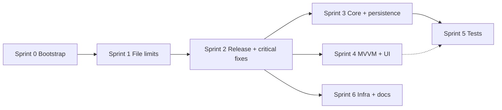

# Build Plan

> Prioritized task board with owner labels, Sequential and Parallel lanes per sprint.
> Move completed items to `COMPLETED_TASKS.md`.

## Owner Label Legend

| Label | Owner | When to use |
|-------|-------|-------------|
| `AGENT` | Cursor Agent | Code, docs, scaffolding, tests, CI config |
| `HUMAN` | Human developer | Approvals, credentials, GitHub settings, product decisions |
| `ADB` | Human (Android) | Android SDK, emulator/device testing (ADB provider testing) |
| `AUTO` | CI/scripts/bots | GitHub Actions, Dependabot, pre-commit, update checker |

**Task format:** `- [ ] [OWNER] Description`

**Filter by label:**

```bash
grep '\[AGENT\]' BUILD_PLAN.md
grep '\[HUMAN\]' BUILD_PLAN.md
grep '\[AUTO\]' BUILD_PLAN.md
```

**Agent rule:** Execute all `[AGENT]` Sequential items first, then dispatch Parallel agents with isolated file scopes.

**Sprint 0 & Sprint 1 complete** — see [`COMPLETED_TASKS.md`](COMPLETED_TASKS.md).

**Sprint 2 agent work (2026-06-13):** Critical fixes, CI hardening, tests, and infra — see [`COMPLETED_TASKS.md`](COMPLETED_TASKS.md#sprint-2--release-readiness--critical-fixes-2026-06-13).

**Remaining human gates:** Push to `main`, CI sign-off on remote, release/version bump, weekly CVE triage.

---

## Sprint 2 — Release Readiness & Critical Fixes

**Goal:** Land bootstrap + Sprint 1 on `main`, fix release-blocking bugs, harden CI before human sign-off.

**Status:** Agent items complete locally (20 tests pass, format clean). Pending human push + remote CI.

### Sequential (must complete in order)

1. [ ] [HUMAN] Push bootstrap + Sprint 1 + Sprint 2 changes to `main`
2. [x] [AGENT] Fix Settings **Save & Close** — `SaveAndCloseSettingsCommand`; wired in `PreferencesOverlayView`
3. [x] [AGENT] Unify folder naming — `GroupFolderNaming` shared by `GroupBuilder` and `IngestEngine`
4. [x] [AGENT] Fix CodeQL workflow — `init` before `dotnet build`
5. [x] [AGENT] Gate `build.yml` on `dotnet test`; release/tag steps only on `workflow_dispatch`
6. [ ] [AUTO] Confirm `ci.yml`, `codeql.yml`, and `security.yml` green on `main` *(pending push)*
7. [ ] [HUMAN] Sign off Sprint 0/1 CI approval in `COMPLETED_TASKS.md`
8. [ ] [HUMAN] Sign off for release (version bump, `CHANGELOG.md`, GitHub Release)

### Parallel

| Task | Owner | Status |
|------|-------|--------|
| Add `dotnet list package --vulnerable` to `ci.yml` | AGENT | ✓ |
| Add `check-license-compliance.sh` to `ci.yml` | AGENT | ✓ |
| Add `dotnet format --verify-no-changes` to `ci.yml` | AGENT | ✓ |
| Add folder-naming parity test | AGENT | ✓ `FolderNamingTests.cs` |
| Add Settings save-and-close test or QA checklist item | AGENT | ✓ test + `RUNBOOK.md` QA |

### Completed in Sprint 2 (archived in `COMPLETED_TASKS.md`)

- SQLite `DeviceId` + `Path` indexes *(already in `DatabaseService`)*
- Magick.NET `14.13.0` → `14.14.0` *(NU190 advisories cleared)*

---

## Sprint 3 — Core Integrity & Persistence

**Goal:** Enforce Core 200-line limit, resolve JSON vs SQLite split-brain, remove dead DI.

**Prerequisite:** Sprint 2 human push.

### Sequential

1. [x] [HUMAN→AGENT] Persistence strategy **B** implemented (JSON + VACUUM-only); recorded in `DECISION_LOG.md` — human may confirm
2. [x] [AGENT] Implement persistence path B — slim `DatabaseService`, remove CRUD from `IDatabaseService`
3. [x] [AGENT] Remove `IMetadataReader` from DI *(class retained for future wiring)*
4. [x] [AGENT] Remove `IWhitelistFilter` from DI; removed `WhitelistFilterTests`
5. [ ] [AGENT] Split `Core/FtpScanner.cs` (628 lines) → listing parser, scan planner, FTP client wrapper
6. [ ] [AGENT] Split `Core/IngestEngine.cs` (486 lines) → naming/verification helpers, parallel orchestration
7. [ ] [AGENT] Split `Core/ThumbnailService.cs` (473 lines) → disk cache, EXIF parser, shell interop
8. [ ] [AGENT] Split `Core/ServiceContracts.cs` (217 lines) → move `IDatabaseService` to `Data/`; factories to `Core/Factories/`
9. [ ] [AUTO] `scripts/check-file-limits.sh` passes with all `Core/**/*.cs` ≤ 200 lines

### Parallel

| Task | Owner | Status |
|------|-------|--------|
| Unify FTP stacks (`FtpWebRequest` scan vs FluentFTP import) | AGENT | — |
| Extract shared media-extension constant | AGENT | — |
| Decouple `ShootFilterService` from ViewModels/Localization | AGENT | — |
| Remove WPF `BitmapSource` from Core contracts (long-term) | AGENT | — |

---

## Sprint 4 — ViewModel & UI Cleanup

**Goal:** Semantic MainViewModel partials, MVVM compliance, decouple overlay UserControls.

**Prerequisite:** Sprint 2 critical fixes done.

### Sequential

1. [ ] [AGENT] Merge `MainViewModel.Part9–Part17` into semantic partials (`ImportEngine`, `Thumbnails`, `DriveScan`, `SourceLoad`)
2. [ ] [AGENT] Rename misnamed partials: `Filters` → `FtpWorkflow`, `Updates` → `SourceLoad`
3. [ ] [AGENT] Add `GlobalUsings.cs` to eliminate duplicate `using` blocks across partials
4. [ ] [AGENT] Replace MainWindow event handlers with VM commands + `IFileDialogService` / `IShellService`
5. [ ] [AGENT] Remove UserControl → `MainWindow` event forwarding; bind overlay actions to inherited `DataContext`
6. [x] [AGENT] Delete dead code-behind: `Token_*`, `Settings_MoveToken*`, `Settings_Save`/`Settings_Close` (~150 lines)
7. [ ] [AUTO] All `*.xaml.cs` ≤ 400 lines after MVVM migration (currently ~1,100 lines aggregate)

### Parallel

| Task | Owner | Status |
|------|-------|--------|
| Fix `SelectAllCheckBox` reflection → `SelectAllShootsCommand` | AGENT | ✓ |
| Move VM status-line English strings to `.resx` | AGENT | — |
| Localize combo preset labels | AGENT | — |
| Add `AutomationProperties.Name` to icon-only sidebar/toolbar buttons | AGENT | — |
| Translate `A11y_NotificationsIcon` in es/fr | AGENT | ✓ |

---

## Sprint 5 — Test Coverage Expansion

**Goal:** Cover highest-risk untested Core paths; establish testability patterns.

**Prerequisite:** Sprint 3 Core splits (test targets stable).

### Sequential

1. [ ] [AGENT] Make `DatabaseService` testable (injectable DB path or connection factory)
2. [ ] [AGENT] Add `FtpScanner` listing parser tests (Unix/DOS/edge cases, 10+ cases)
3. [ ] [AGENT] Extend `IngestEngineTests` — duplicate policy (Skip/Suffix/OverwriteIfNewer), strict SHA-256 verify
4. [x] [AGENT] Add `KeywordInputParser` tests *(4 cases; `LocalScanner` extension-filter tests deferred)*
5. [ ] [AUTO] Document Core coverage baseline in `COMPLETED_TASKS.md` or CI summary

### Priority test matrix

| Component | Current risk | Target | Status |
|-----------|--------------|--------|--------|
| `FtpScanner.TryParseListingLine` | 628 lines, zero tests | ≥10 parser cases | — |
| `IngestEngine` verify/duplicate | 2 tests only | ≥6 policy cases | — |
| `DatabaseService` | VACUUM-only | Injectable + VACUUM test | — |
| `FolderNamingStrategy` | Import ≠ export paths | Parity test | ✓ Sprint 2 |
| `ThumbnailService` | 473 lines, WPF-coupled | Defer until Sprint 3 split | — |

---

## Sprint 6 — Infrastructure & Dev Experience

**Goal:** Windows-native validation, reproducible builds, agent-ready docs.

### Sequential

1. [x] [AGENT] Create `scripts/validate-local.ps1` mirroring bash gates
2. [x] [AGENT] Enable `RestorePackagesWithLockFile`; commit `packages.lock.json`
3. [x] [AGENT] Expand `docs/FOR_AGENTS.md` — architecture map, partial-file conventions, gate commands
4. [x] [AGENT] Add `docs/DEV_SETUP_WINDOWS.md`
5. [x] [AGENT] Add `check-file-limits.sh` and `check-license-compliance.sh` to `.pre-commit-config.yaml`
6. [ ] [HUMAN] Run first weekly CVE triage per `docs/SECURITY_TRIAGE.md`

### Parallel

| Task | Owner | Status |
|------|-------|--------|
| Bump `Microsoft.Extensions.*` to latest 8.0.x patch | AGENT | ✓ already 8.0.1 |
| Bump test packages (`xunit`, `Microsoft.NET.Test.Sdk`) | AGENT | ✓ 2.9.2 / 17.11.1 |
| Audit `System.Data.SQLite.Core` vs `Microsoft.Data.Sqlite` | AGENT + HUMAN | — backlog |
| Plan MaterialDesignThemes 4.x → 5.x migration | HUMAN | — backlog |

---

## Ongoing Maintenance

### Weekly (recurring)

- [ ] [HUMAN] Run weekly CVE triage pass per `docs/SECURITY_TRIAGE.md` (recommended: Monday)
- [ ] [AGENT] Apply Dependabot dependency bumps and open PRs as needed
- [ ] [AUTO] Trivy + CodeQL + CI green after merges

---

## Milestone Gates

| Gate | Owner | Status | Sprint |
|------|-------|--------|--------|
| Regression tests: zero failures | AUTO | ✓ 20 tests locally | 2 |
| Settings Save & Close persists config | AGENT | ✓ fixed | 2 |
| Import folder names = export folder names | AGENT | ✓ `GroupFolderNaming` | 2 |
| UTF-8 encoding check clean | AUTO | Pass locally | — |
| `TEMPLATE_INDEX.json` complete | AUTO | Pass locally | — |
| ViewModel/`*.xaml.cs` line limits | AUTO | Pass locally | 1 ✓ |
| Core `/**/*.cs` ≤ 200 lines | AUTO | **4 files over** | 3 |
| No dead DI registrations | AGENT | ✓ removed | 3 |
| CodeQL analysis valid (init before build) | AUTO | ✓ fixed locally | 2 |
| Release gated on tests | AUTO | ✓ `build.yml` | 2 |
| `dotnet format` enforced in CI | AUTO | ✓ `ci.yml` | 2 |
| NuGet audit clean in CI | AUTO | ✓ `ci.yml` | 2 |
| Static analysis and vulnerability scans clean | AUTO | Magick.NET fixed; confirm after push | 2 |
| Weekly CVE triage within last 7 days | HUMAN | Not started | 6 |
| Zero open Critical/High Dependabot alerts | HUMAN | Magick.NET resolved at 14.14.0 | — |
| `CHANGELOG.md` updated (Keep a Changelog) | HUMAN | — | 2 |
| Version bumped and GitHub Release drafted | HUMAN | Current: 1.3.1 | 2 |
| `THIRD_PARTY_LICENSES.md` reviewed for distribution | HUMAN | Sprint 0 ✓ | — |
| Core test coverage baseline documented | AUTO | 20 tests; partial Core coverage | 5 |
| Windows local validation script exists | AGENT | ✓ `validate-local.ps1` | 6 |

---

## Optional Backlog (not blocking)

| Task | Owner | Notes | Depends on |
|------|-------|-------|------------|
| Extract Sidebar UserControl | AGENT | `MainWindow.xaml` 755 lines (under 800) | Sprint 4 MVVM |
| Extract ShootGroups / ImportToolbar UserControls | AGENT | Reduces monolithic XAML further | Sprint 4 |
| Remove WPF types from Core models (`ImportItem.Thumbnail`) | AGENT | Architectural purity | Sprint 3 |
| MaterialDesignThemes 5.x upgrade | HUMAN | Breaking; UI regression risk | — |
| ADB provider device testing | ADB | Emulator/hardware validation | — |
| Headless WPF smoke test in CI | AGENT | Launch + exit code check | Sprint 6 |
| MSI install/uninstall CI step | AGENT | WiX validation on `windows-latest` | Sprint 2 build gate |

---

## Sprint dependency graph



**Agent dispatch order:** Sprint 2 human push → Sprint 3 Core splits → Sprint 4 MVVM → Sprint 5 tests.
