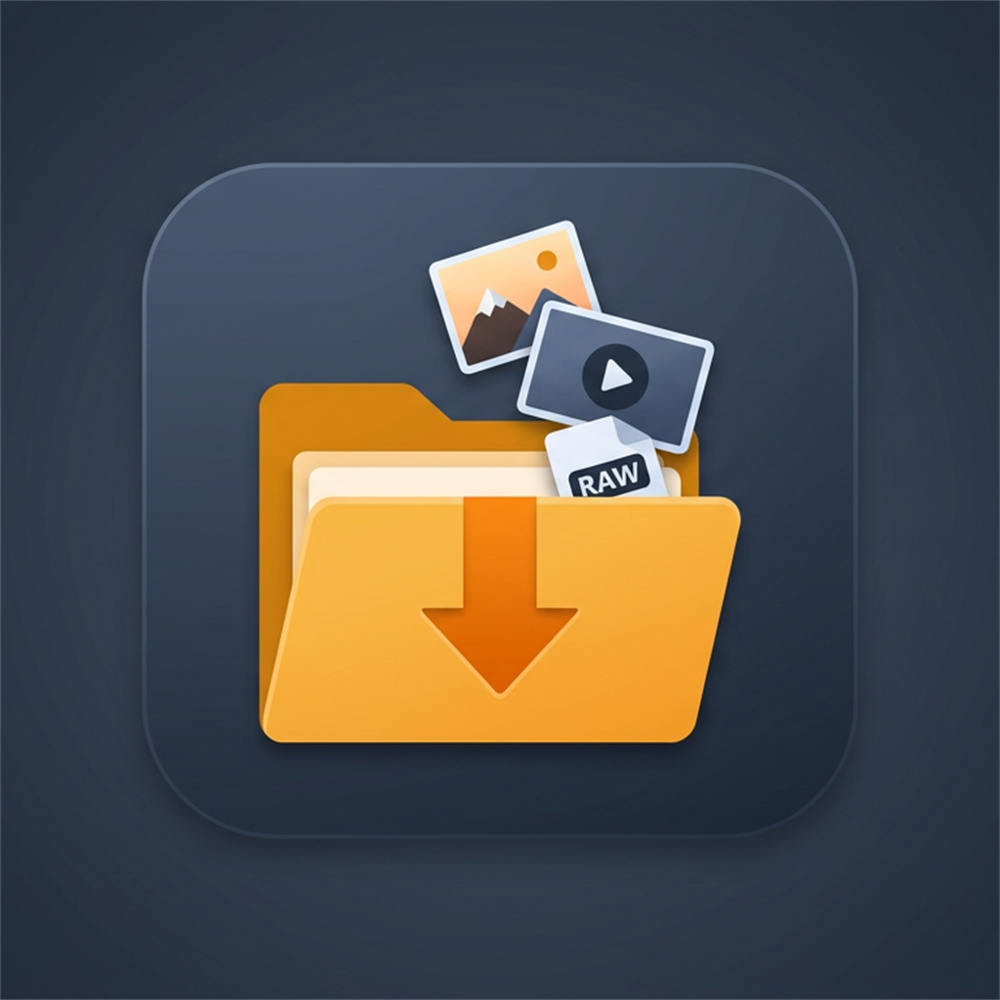

<p align="center">
  
</p>

<h1 align="center">Quick Media Ingest</h1>

**Quick Media Ingest** is a fast, open-source media importer for photographers and videographers. Ingest photos and videos from **SD cards**, **local drives**, and **FTP** (including common **phone / camera Wi‑Fi** shares) into **dated, shoot-based** destination folders with **configurable file naming**, **metadata options**, and **safety checks**.

The app takes inspiration from classic import tools, with a **Material Design**-influenced **dark / light** theme, a **unified** view that can merge **removable + FTP** sources, and **exclusion / blacklist** rules so you control what never appears in the list.

---

## Key features

### Sources and scanning

* **Single source or Unified (SD + FTP)**: Pick one drive, one FTP source, or **Unified** to merge all active local and FTP sources into one review surface.
* **Rescan and refresh**: Sidebar and top bar actions refresh drives and rebuild the unified list; configurable **scan subfolders**.
* **FTP sources**: Add servers from the sidebar, optional reconnect on startup, browse/test connection, preset folder paths.
* **Drive inclusion**: Choose which fixed/removable volumes participate in quick scans (drive picker overlay).
* **Verbose scan progress**: Overlay with folder/file counts, current path, FTP prescan phase, and overall progress—dismissed as soon as the merged list is ready so long preview loads do not block the UI (**v1.2.1**).

### Exclusions and filtering

* **Scan exclusions**: Dedicated sidebar entry opens a panel to **exclude whole drives** from scans and maintain a **per-source folder blacklist** (paths under a source hidden from results until you remove the rule).
* **Shoot-level “ignore folder”**: From a shoot, add a folder to the blacklist without opening Preferences first.
* **Shoot grouping**: Adjustable **hours-between-shoots** slider on the toolbar; cached rescans reuse stored file lists where possible.

### Previews

* **Auto thumbnails**: Local, FTP, and Unified loads generate previews for images and videos during/after scan (performance modes from **Low** through **Ultra** tune worker counts).
* **RAW-aware**: Prefer sidecar JPEG/HEIF next to RAW when present; shell-provided thumbnails where codecs allow.
* **Stacks vs expand**: Optionally **stack RAW + rendered** in one preview row or **expand side-by-side** for comparison.

### Import pipeline

* **Selections**: Select shoots or individual files; naming template with **date, time (incl. milliseconds when available), sequence, shoot name, original name**, separators, presets, live examples.
* **Safety**: Optional **confirmation before import**; **duplicate policies** (`Suffix`, `Skip`, `OverwriteIfNewer`); **verification** (`Fast` size vs `Strict` hash).
* **Delete after import**: Toggle with first-run warning; persisted acknowledgement.
* **Embed keywords**: Optional writing of keywords into metadata on copy (when enabled).
* **Reports**: `_ImportReports` artifacts (JSON/text) under the destination; notification feed and status lines for last run summary.
* **Advanced workflow**: **Preflight**, **Queue**, **Retry failed**, **Resume pending plan** after interruption.

### Updates and diagnostics

* **About & Updates**: Version, **build date**, check for updates (portable `.exe` or installer `.msi` channels), selective download with progress; **changelog** / **releases** links; logs folder and diagnostics shortcuts.
* **Updater handoff**: External updater can wait for the app to exit before replacing files (reduces “file in use” install failures).

### Look and feel (**v1.2.1**)

* **Localization**: UI strings via `.resx` with **English**, **Spanish**, and **French**; language choice in **Preferences** (restart may be needed for some chrome).
* **Consistent modal chrome**: FTP, drive picker, scan/import progress, About, skipped-folder summary, **Preferences**, **Scan exclusions**, and **Import history** share the same **blurred dimmed backdrop**; **Escape** closes the topmost overlay in a fixed order; **F1** opens **keyboard shortcuts**.
* **Scan summaries**: After a scan, paths skipped **only because of your exclusion rules** are explained separately from **FTP listing errors**; optional **don’t remind again** for exclusion-only summaries (saved in config).
* **Sidebar**: Collapsible rail; **theme** toggle under the collapse control when expanded, **icon-only** theme when collapsed; **Notifications** panel focuses on readiness + feed (update checks live under **About & Updates**).
* **Updates**: Optional **desktop popup** when a **new GitHub release** is detected (see **CHANGELOG**).

---

## Usage (quick path)

1. Add **sources** (drives appear from Windows; add **FTP** if needed).
2. Choose **one source** or **Unified (SD + FTP)**.
3. **Scan** (toolbar / context as needed)—review **shoots**, rename titles, set **keywords** per shoot if you use that workflow.
4. Optionally **Preflight** or **Queue** batches.
5. **Import**—watch overall and per-group progress, ETA, speed, failures.
6. Use **Refresh** when you swap cards or want a forced rescan.

---

## Settings (sidebar)

The **Settings** expander includes:

* **Preferences** — destination, naming, language, thumbnail performance, stacks, duplicate/verification, keyword embedding, confirm-before-import, advanced options, presets.
* **Scan exclusions** — excluded drives and ignored folder rules (blacklist).
* **Add FTP Source**
* **Import History**
* **About & Updates**

**Theme** (dark/light) lives **under the sidebar collapse control** in the header (not inside this list).

---

## Build and development

* **.NET 8**, **WPF**, **C#**, **Windows** desktop.

Single-file portable test build:

```bash
build_local_test.bat
```

Output: `publish/local-test/QuickMediaIngest.exe`

`build_and_push.bat` / `create_release_tag.bat` can drive versioning and release tagging; CI may build portable EXE + MSI and publish GitHub releases (see repo workflows).

### Version

The shipping version is set in **`QuickMediaIngest/QuickMediaIngest.csproj`** (`<Version>`) and shown in the app **About** dialog.

---

## Theme QA

Before large UI changes, see **`docs/THEME_QA_CHECKLIST.md`** (if present).

---

## Contributing

Issues and pull requests are welcome for workflow, UI, and reliability improvements.

## License

This project is free and open source. A formal license file may be added later.
